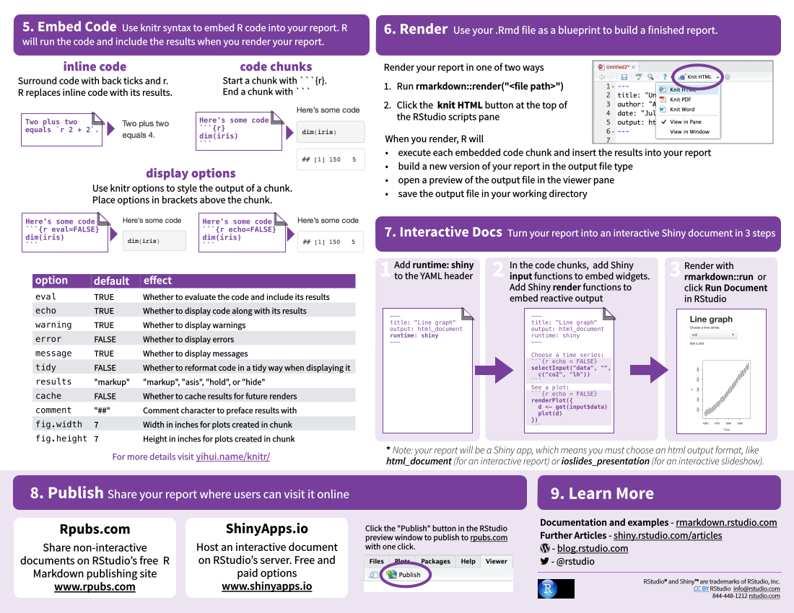
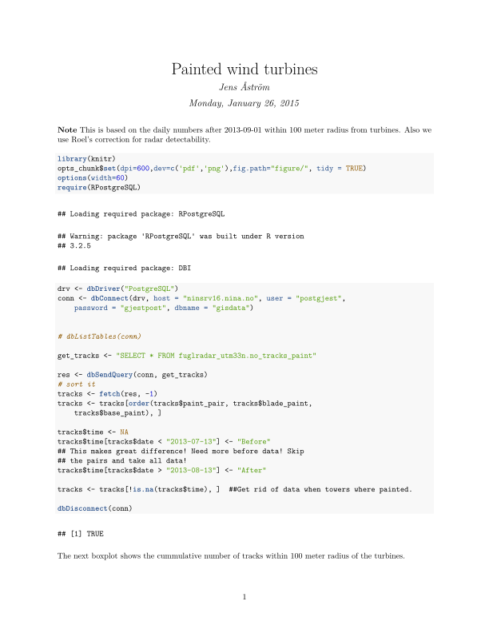
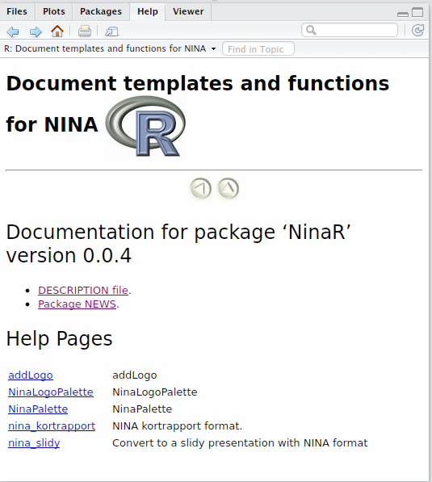
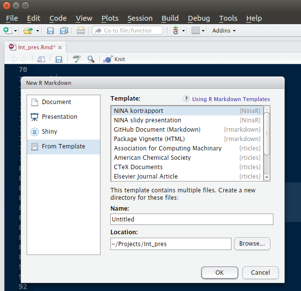
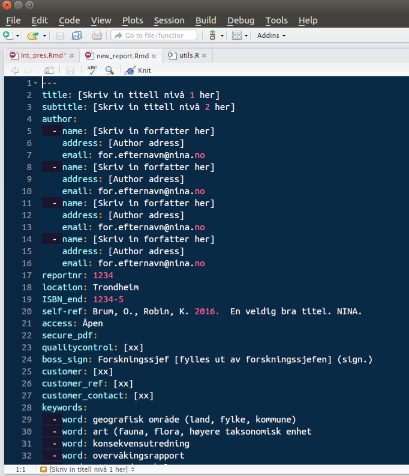
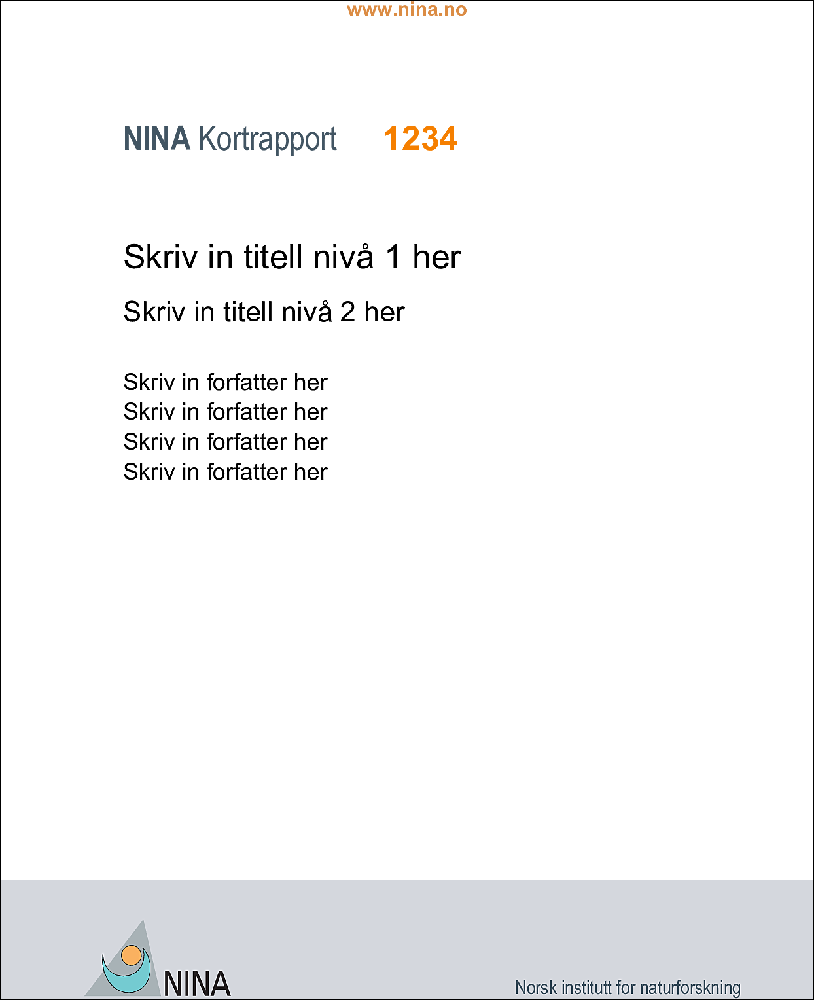
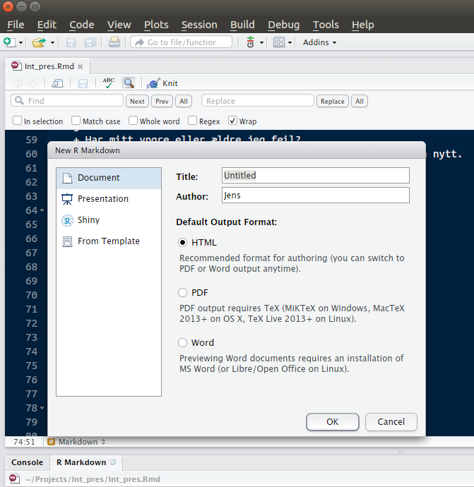

```{r setup, echo=F}
require(NinaR)
require(knitr)
require(shiny)
opts_chunk$set(echo = TRUE, tidy = TRUE, fig.path="figure-slidy")

knit_hooks$set(source = function(x, options){
  if (!is.null(options$verbatim) && options$verbatim){
    opts = gsub(",\\s*verbatim\\s*=\\s*TRUE\\s*", "", options$params.src)
    bef = sprintf('\n\n    ```{r %s}\n', opts, "\n")
    stringr::str_c(
      bef, 
      knitr:::indent_block(paste(x, collapse = '\n'), "    "), 
      "\n    ```\n"
    )
  } else {
    stringr::str_c("\n\n```", tolower(options$engine), "\n", 
      paste(x, collapse = '\n'), "\n```\n\n"
    )
  }
})

```
Innhold {.incremental}
========

Tre verktøy
----------

- (R)Markdown
- Shiny
- Git

Og en R-pakke
-----------------
- NinaR


Reproduserbarhet - hva andre sier {.incremental}
============

```{r, out.width=300, echo=F}

``` 

>- Jeg skjønner ikke hva du gjort!
>- Jeg får ikke samme resultater som du!
>- Hvordan kan jeg sjekke analysene dine?
>- Hvordan kan jeg lære av analysene dine?


Reproduserbarhet - hva du sier {.incremental}
============

```{r, out.width=300, echo=F}

```

>- Det tar tid og blir feil når jeg bruker copy paste til Word!
>- Jeg husker ikke hva jeg gjorde!
>- Jeg får ikke samme resultater som tidligere!
>- Det var ett skrivefeil i protokollet, så jeg må kjøre allt på nytt!
>- Jeg skal gjøre noe liknende igjen men rekker ikke lage allt fra start!

Reproduserbarhet {.incremental}
============

Grunnleggende egenskap hos vetenskap
--------------

- Allt mer kompliserte analyser - hur lager vi reproduserbare analyser?
    + Återskape veien fra data til resultat
- Dokumentasjon av analyser kommer ingå i ISO-planen for databearbeiding.
- Reproduserbare analyser er den etiske måten å arbeide på.
- Problem
    + Mange programvarer lager ikke spor
        + Excel, SPSS, Minitab etc.
<br>        

R to the rescue(?)
----------------------------

- Det finns bedre måter enn rene skriptfiler!

Bruk alltid markdown! {.incremental}
========

Når du vel prøvt det, vil du aldrig gå tilbake.
------------------

- Samle kommentarer, kode og resultater i ett dokument.
- Koden kjøres når dokumentet lages
    + Alltid uppdaterte resultater
- Enkelt
    + Enklere enn Sweave (trenger ikke å lære $\LaTeX$)
- Flere outputs
    + html (publisere)
    + Word (standard for mange)
    + pdf (penest, lese, printe, publisere i trykk)


Arbeidsflyt
===============

```{r, echo=F, out.width=800}
include_graphics("img/pdf/page1.svg")
```


Arbeidsflyt
===============

```{r, echo=F, out.width=800}

```


Markdown
============

Brukes enklest gjennom Rstudio. 

Alternativt: 

- `install.packages("rmarkdown")`
- installere [pandoc](http://johnmacfarlane.net/pandoc/installing.html)
    + Greit verktøy å ha ellers også

Kan også brukes uten Rstudio
```{r, eval=F}
rmarkdown::render("minfil.Rmd")
```

Til og med fra terminalen (kan f. eks. kjøres på skjema-basis)
```{bash, eval=F}
R -e "rmarkdown::render(\"minfil.Rmd\")"

```


Markdown
=========

```{r, echo=F, out.width=600}

```


Eksempel
================

Her kommer et eksempel, kommentarer skrivs i vanlig tekst. Kod skrives slik:
```{r, verbatim=T}
x<-1:10
x
```


Eksempel - kod
================

```{r}
set.seed(12345)
x=1:100
y=0.5*x+rnorm(100, 0, 30)
mod1<-glm(y~x)
summary(mod1)

```

Eksempel - tabeller
================

```{r, warnings=F, message=F}
library(pander)
pander(mod1)

```
Eller

```{r}
knitr::kable(summary(mod1)$coefficients, digits=2)
```
<br>

Alternativt for pdf
```{r, results='asis', eval=F}
require(xtable)
print(xtable(summary(mod1)$coefficients), type="html")
```


Eksempel - figurer
============

```{r mod_fig, fig.cap="Model validations"}
par(mfrow=c(2,2))
plot(mod1)

```


Markdown
========

- Intro markdown
    + Gå igjennom alle fordeler med å bruke rmarkdown i dagligt bruk
    + Reproduserbarhet
    + Eksempel på ulike outputs
    + Referanseliste, sitere, JRef
    + Vis kortrapport-templat
    + Slidy-templat
    + Encodings! UTF-8
    + xtable, knitr::kable
    
Innhold (forts.)
==========

- Steg fra start, installasjon rstudio, MikTeX, NinaR
- Automatiserte, gjennbruke templater
- Shiny
    + Diverse brukstyper
    + Eksempel
    + Visualisere
    + Laste ned
    + Laste opp
    + Seatrack, DS_kursapp, humle/iframe

Innhold (forts.)
==============

- Git
    + NINAnor
    + Bruke i R
    + Terminal
    + Provosere frem god arbeidsmåte, folderstruktur.
- NinaR
    + Andre funksjoner (enn templater)
    + Skriv funksjoner
- Begynn her
    + linker til info til de ulike verktøyen
    

NinaR - en R-pakke for NINA!
========

- R blir altmer "standarden" for statistisk analyse, også i NINA
    + Hvorfør ikke lage en R-pakke med funksjoner tilpasset NINA?

NinaR - en R-pakke for NINA!
========

- R blir altmer "standarden" for statistisk analyse, også i NINA
    + Hvorfør ikke lage en R-pakke med funksjoner tilpasset NINA?

```{r, eval=F}
library(devtools)
install_github("NINAnor/NinaR")
```

```{r, echo=F, out.width = 400, fig.retina = NULL, fig.cap="Available functions in NinaR V 0.0.4"}

```


Rapport-maller
==========



Alternativt
```{r, eval=F}
rmarkdown::draft("new_report", "nina_kortrapport", package="NinaR")
```

Rapport-maller
==========

```{r, echo=F, out.width = 600, fig.retina = NULL, fig.cap="Nina kortrapport template"}

```

Rapport-mall
==========

```{r, echo=F, out.width = 500, fig.retina = NULL, fig.cap="Nina kortrapport template"}

```


Rapport-maller
==========

- Pros
    + Kod og rapport hålls sammen
    + Enkelt å vise statistisk metodikk
- Cons
    + Kolleger vill fortsatt bruke Word

Presentasjon-maller
===========


Alternativt
```{r, eval=F}
rmarkdown::draft("new_report", "nina_slidy", package="NinaR")
```


Referenser
==========

-Bruk bib-fil (f.eks. [JabRef](http://www.fosshub.com/JabRef.html))


Kan skrives `[@NinaR]` for [@NinaR] eller `[-@NinaR]` om du allerede nevner navnet, for eksempel kan vi refererere til hva Pedersen et al. skrev [-@Pedersen2016]. 

For kortrapport og andre $\LaTeX$ dokument, bruk `\citet{astrom2016}`, se eksempel i mallen. 


NINA-grafik
==========

```{r, out.width=700}
require(NinaR)
NinaPalette()

plot((1:10)^2, 1:10, col=NinaPalette(), cex=4, pch=16, las=1)

```

NINA-grafik
==========

```{r, message=F, out.width=700}
plot((1:10)^2, 1:10, col=NinaPalette(), cex=4, pch=16, las=1)
addLogo()

```

NINA-grafik
==========


```{r, out.width=700}
plot((1:10)^2, 1:10, col=NinaPalette(), las=1, type="n")
addLogo(x = 0.5, y = 0.5, size = 1)
grid.rect(gp = gpar(fill = rgb(1, 1, 1, .6)))
points((1:10)^2, 1:10, col=NinaPalette(), cex=4, pch=16)
```

NinaR: To-do
========

- Beamer-templat?
- NINA rapportmall? 
- Fler funksjoner?


Shiny
============

```{r}
shinyAppDir("seatrack_shiny", options=list("height"=1000), encoding="UTF-8")

```


Shiny
=========

```{r eruptions, echo=FALSE}
inputPanel(
  selectInput("n_breaks", label = "Number of bins:",
              choices = c(10, 20, 35, 50), selected = 20),
  
  sliderInput("bw_adjust", label = "Bandwidth adjustment:",
              min = 0.2, max = 2, value = 1, step = 0.2)
)

renderPlot({
  hist(faithful$eruptions, probability = TRUE, breaks = as.numeric(input$n_breaks),
       xlab = "Duration (minutes)", main = "Geyser eruption duration")
  
  dens <- density(faithful$eruptions, adjust = input$bw_adjust)
  lines(dens, col = "blue")
})
```


Versjonering 
===================

```{r phd_comics, echo=F, out.height=600, fig.cap="Alle bruker noen form av versjonering"}

```

Versjonering - Git
=============

Fordeler med et "riktigt" versjoneringssystem
----------------------------

- Reproduserbarhet: alle steg logges
- Sinnesfrid: et robust backup-system
- Fleksibilitet: enkelt å lage nye "grener"
- Samarbeide: synkronisere versjoner mellom flere PC

Versjonering - Git
=============

Fordeler med et "riktigt" versjoneringssystem
----------------------------

- Reproduserbarhet: alle steg logges
- Sinnesfrid: et robust backup-system
- Fleksibilitet: enkelt å lage nye "grener"
- Samarbeide: 
    + Synkronisere versjoner mellom flere PC
    + Publisere på github
    + Installere fra R

 <br>
 
Nackdeler med et "riktigt" versjoneringssystem
----------------

- Ennå en ting å lære seg
- Fungerer dårligt med Word (fungerer bra med tekstfiler)


Bruk alltid markdown!
========

```{r, echo=F, fig.cap="Spesielt enkelt i Rstudio", fig.width=50}

```

Bruk alltid markdown!
========

```{r, echo=F, fig.cap="Starte med eksisterende mall", fig.width=50}
include_graphics("img/markdown_templ.png")
```


# References
