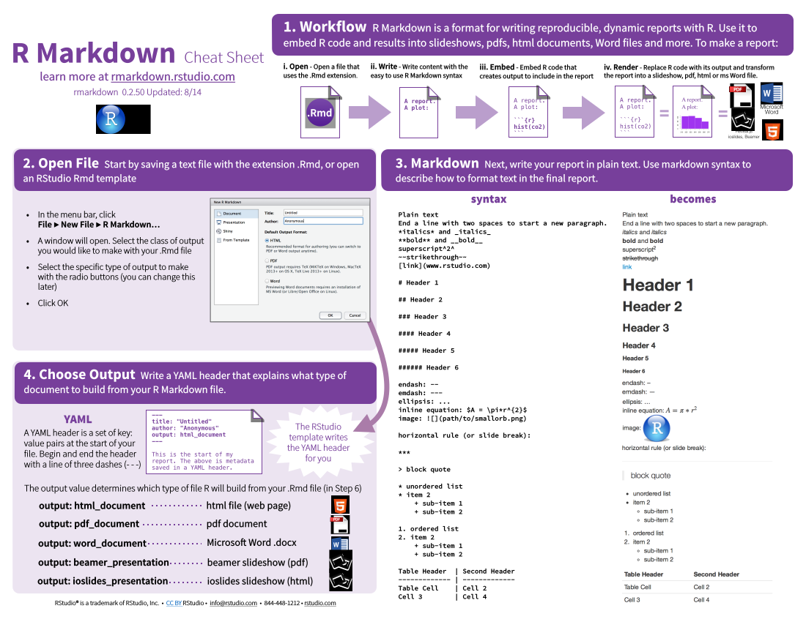

```{r setup, echo=F, message=F}
require(NinaR)
require(knitr)
require(shiny)
opts_chunk$set(echo = TRUE, tidy = TRUE, fig.path="figure-slidy/")

knit_hooks$set(source = function(x, options){
  if (!is.null(options$verbatim) && options$verbatim){
    opts = gsub(",\\s*verbatim\\s*=\\s*TRUE\\s*", "", options$params.src)
    bef = sprintf('\n\n    ```{r %s}\n', opts, "\n")
    stringr::str_c(
      bef, 
      knitr:::indent_block(paste(x, collapse = '\n'), "    "), 
      "\n    ```\n"
    )
  } else {
    stringr::str_c("\n\n```", tolower(options$engine), "\n", 
      paste(x, collapse = '\n'), "\n```\n\n"
    )
  }
})

```
Innhold {.incremental}
========

Tre verktøy for R
----------

- (R)Markdown
- Shiny
- Git

Og en R-pakke
-----------------
- NinaR


Reproduserbarhet - hva andre sier {.incremental}
============

```{r, out.width=300, echo=F}
include_graphics("img/how_did_you.jpg")
``` 

>- Jeg skjønner ikke hva du gjort!
>- Jeg får ikke samme resultater som du!
>- Hvordan kan jeg sjekke analysene dine?
>- Hvordan kan jeg lære av analysene dine?


Reproduserbarhet - hva du sier {.incremental}
============

```{r, out.width=300, echo=F}
include_graphics("img/what_did_i.jpg")
```

>- Jeg husker ikke hva jeg gjorde!
>- Jeg får ikke samme resultater som tidligere!
>- Det tar tid og blir feil når jeg bruker copy paste til Word!
>- Det var ett skrivefeil i protokollet, så jeg må kjøre allt på nytt!
>- Jeg skal gjøre noe liknende igjen men rekker ikke lage allt fra start!

Reproduserbarhet {.incremental}
============

Grunnleggende egenskap hos vetenskap - forstå og replikere
--------------

- Allt mer kompliserte analyser - hur lager vi reproduserbare analyser?
    + Återskape veien fra data til resultat
- Dokumentasjon av analyser kommer ingå i ISO-planen for databearbeiding.
- Reproduserbare analyser er den etiske måten å arbeide på.
- Problem
    + Mange programvarer lager ikke spor
        + Excel, SPSS, Minitab etc.
    + Vanskelig å skrive å oppdatere gode analyseprotokoll
<br>        

R to the rescue(?)
----------------------------

- Copy paste til Word er en arbeidsom og usikker måte å arbeide på!
- Rene skriptfiler er vanskelig å læse og viser ikke resultat!

Bruk alltid markdown! {.incremental}
========

Når du vel prøvt det, vil du aldrig gå tilbake.
------------------

- Samle kommentarer, kode og resultater i ett dokument.
- Koden kjøres når dokumentet lages
    + Alltid uppdaterte resultater
- Enkelt
    + Enklere enn Sweave (trenger ikke å lære $\LaTeX$)
- Flere outputs
    + html (publisere)
    + Word (standard for mange)
    + pdf (penest, lese, printe, publisere i trykk)
- Blir altmer standarden å jobbe i R. Pionjerarbeid av Rstudio.
- Provoserer frem bedre kod. Din kod skal kunne leses!


Kort ordliste
======================

- Markdown - enkelt typsettingspråk, allt mer brukt.
- rmarkdown - R-pakke for lenke sammen R-kod og Markdown
- knitr - R-pakke som gjør mye av jobben i rmarkdown
- pandoc - konverterer et dokumentformat til et annet, brukes i rmarkdown
- $\LaTeX$ - eldre, mer kraftfullt typsettingsspråk.
- Sweave - R-pakke for å lenke sammen R-kod og $\LaTeX$


Arbeidsflyt - zoom inn
===============

```{r, echo=F, out.width=800}

```


Arbeidsflyt - zoom inn
===============

```{r, echo=F, out.width=800}

```


Markdown
============

Brukes enklest gjennom Rstudio, allt fungerer out of the box, foruten  å lage pdf. 

Alternativt: 

- `install.packages("rmarkdown")`
- installere [pandoc](http://johnmacfarlane.net/pandoc/installing.html)
    + Greit verktøy å ha ellers også

Klikke på Knit, eller:
```{r, eval=F}
rmarkdown::render("minfil.Rmd")
```

Kan også kjøres fra terminalen (kan f. eks. kjøres på skjema-basis)
```{bash, eval=F}
R -e "rmarkdown::render(\"minfil.Rmd\")"

```

Markdown
=========

Pdf - penest, kan også produsere ferdige artikler. Du kan blande markdown og $\LaTeX$ kod i samme dokument.
---------

For å lage pdf på windows maskin, installere [MikTeX](). På Mac, installere [MacTeX](http://tug.org/mactex/). Linux-maskiner bruker ofte TeX_Live. 

```{r, echo=F, out.width=600}

```


Eksempel
================

Her kommer et eksempel, kommentarer skrivs i vanlig tekst. Kod skrives slik:
```{r, verbatim=T}
x<-1:10
x
```

Eksempel - kod
================

```{r}
set.seed(12345)
x=1:100
y=0.5*x+rnorm(100, 0, 30)
mod1<-glm(y~x)
summary(mod1)
```

Eksempel - kod
================

Du kan også kjøre r-kod i teksten, gjennom å skrive (for eksempel)
```{r, eval=F}
`r round(coef(mod1)[2], digits=2)`.
```
Hvilket viser at parameter estimatet, eller hellningen på linjen er estimert til `r round(coef(mod1)[2], digits=2)`.


Eksempel - tabeller
================

```{r, warnings=F, message=F}
pander::pander(mod1)
```

```{r}
knitr::kable(summary(mod1)$coefficients, digits=2)
```
<br>

Flotteste tabellene lages i pdf.
```{r, results='asis', eval=F}
require(xtable)
print(xtable(summary(mod1)$coefficients), comments=F)
```
```{r, echo=F, out.height=270}

```


Eksempel - figurer
============

```{r mod_fig, fig.cap="Model validations"}
par(mfrow=c(2,2))
plot(mod1)

```

Eksempel - ligninger/ekvasjoner {.incremental}
============

Ligninger skreves i $\LaTeX$-format (som i Open Office). For eksempel `$y= \beta_0 + \beta_1$` blir $y= \beta_0 + \beta_1$.

<br>
Ligninger plasseres utenfor tekst gjennom å bruke `$$ y=x $$`.

$$\begin{align*}
 f(x)  &= a x^2+b x +c   &   g(x)  &= d x^3 \\
 f'(x) &= 2 a x +b       &   g'(x) &= 3 d x^2
\end{align*}$$

God å typsette mer komplekse eksempler

$$\begin{aligned}
\mathcal{L}^{-1}\left\{f(d)\right\} &= \mathcal{L}^{-1}\left\{f_1(\delta).f_2(\delta)\right\} \\
& = \exp{(mt)} \star \left\{\frac{l}{2\sqrt{\pi t^3}} exp{(-l^2/{4t})}\right\} \\
& = F_1 * F_2
\end{aligned}$$
          
Eksempler
==========
- Viser pdf og word (finnes i folder "examples")


NinaR - en R-pakke for NINA!
========

- R blir altmer "standarden" for statistisk analyse, også i NINA
    + Hvorfør ikke lage en R-pakke med funksjoner tilpasset NINA?

NinaR - en R-pakke for NINA!
========

- R blir altmer "standarden" for statistisk analyse, også i NINA
    + Hvorfør ikke lage en R-pakke med funksjoner tilpasset NINA?

```{r, eval=F}
library(devtools)
install_github("NINAnor/NinaR")
```

```{r, echo=F, out.width = 400, fig.retina = NULL, fig.cap="Funksjoner i NinaR V 0.0.4"}
include_graphics("./img/NinaR_help.png")
```


Rapport-maller
==========


Alternativt
```{r, eval=F}
rmarkdown::draft("new_report", "nina_kortrapport", package="NinaR")
```

Rapport-mall
==========

```{r, echo=F, out.width = 600, fig.retina = NULL, fig.cap="NinaR mall for kortrapport"}
include_graphics("./img/nina_kort_template.png")
```

Rapport-mall
==========

```{r, echo=F, out.width = 600, fig.retina = NULL, fig.cap="Produserer en åpen eller lukket pdf"}

```


Rapport-maller
==========

- Pros
    + Kod og rapport hålls sammen
    + Enkelt å vise statistisk metodikk
    + Vil for enkelte prosjekt spare mye tid.
    + Kan automatiseres
    + Penere resultat-seksjon
- Cons
    + Mer vanskelig å samarbeide med dem som vil bruke Word
    + Nesten ferdig

Presentasjon-maller
===========


Alternativt
```{r, eval=F}
rmarkdown::draft("new_report", "nina_slidy", package="NinaR")
```


Referenser {.incremental}
==========

- Ja, det fungerer. Referanser fylles i automatiskt på sluttet. Flere formater å velge mellom.
- Bruk en bib-fil (en vanlig tekstfil og standarden i R). Endnote kan eksportere i bib-format.
- Hver referanse trenger en "label". Bruk f.eks. [JabRef](http://www.fosshub.com/JabRef.html) for å generere labels å administrere dine referanser.

```{r}
citation("NinaR")

```


Kan skrives `[@NinaR]` for [@NinaR] eller `[-@NinaR]` om du allerede nevner navnet, for eksempel kan vi refererere til hva Pedersen et al. skrev [-@Pedersen2016]. 

For kortrapport, bruk $\LaTeX$-kommandoet`\citet{NinaR}`, se eksempel i mallen. 


NINA-grafik {.incremental}
==========

```{r, out.width=700, fig.cap="NINA-farger enligt NINAs grafiske standard"}
require(NinaR)
NinaPalette()
set.seed(123)
barplot(runif(5), col=NinaPalette())
```

NINA-grafik {.incremental}
==========

```{r, out.width=700, fig.cap="NINAs logofarger"}
NinaLogoPalette()
set.seed(123)
barplot(runif(3), col=NinaLogoPalette())
```

NINA-grafik
==========

```{r, out.width=1000, dev='svg', verbatim=T, message=F}
plot((1:10)^2, 1:10, col=NinaPalette(), cex=4, pch=16, las=1)
addLogo()

```

NINA-grafik
==========

```{r, out.width=1000, dev='svg'}
plot((1:10)^2, 1:10, las=1, type="n")
addLogo(x = 0.5, y = 0.5, size = 1)
grid.rect(gp = gpar(fill = rgb(1, 1, 1, .6)))
points((1:10)^2, 1:10, col=NinaPalette(), cex=4, pch=16)
```

NINA-grafik - transparanse
==========

```{r, out.width=700}
set.seed(123)
barplot(runif(5), col=addAlpha(NinaPalette(), 0.4))
```


NinaR: To-do 2016-04-28
========

- Fler funksjoner?
    + Kom med forslag!
- Forbedre css style sheets
- Lage style sheets til Shiny
- Beamer-templat? (pdf presentasjon)
- NINA rapportmall? (Hvor mange vil bruke?)
- Bidra med kod på http:/github.com/NINAnor/NinaR


Shiny - interaktivt R! 
=========


Shiny - interaktivt R! 
=========

```{r eruptions, echo=FALSE}
inputPanel(
  selectInput("n_breaks", label = "Number of bins:",
              choices = c(10, 20, 35, 50), selected = 20),
  
  sliderInput("bw_adjust", label = "Bandwidth adjustment:",
              min = 0.2, max = 2, value = 1, step = 0.2)
)

renderPlot({
  hist(faithful$eruptions, probability = TRUE, breaks = as.numeric(input$n_breaks),
       xlab = "Duration (minutes)", main = "Geyser eruption duration")
  
  dens <- density(faithful$eruptions, adjust = input$bw_adjust)
  lines(dens, col = "blue")
})
```

Shiny - Hvordan?
==========

- Start med [tutorial](http://shiny.rstudio.com/tutorial/)
- Bruk ferdige templat, see mange eksempler på [showmeshiny](http://www.showmeshiny.com/)
- Spør noen som kan. 
- Kan inkluderes i andre sites via iframes se for eksempel http://www.nina.no/Milj%C3%B8overv%C3%A5king/Humler-og-dagsommerfugler/Data-fra-prosjektet
- Nina har installert shiny-server på
    + Ninsrv16.nina.no - Intern plass for testing. Lagres på /srv/shiny-server/din_app. Vises på http://ninsrv16.nina.no:3838/din_app
    + ninweb04.nina.no - Vises eksternt på shiny.nina.no:8080/
- Publisere
    + Direkte fra Rstudio gratis på http://shinyapps.io
    + N16 - krever inlogg, enklest gjennom git
    + Ninweb04 - Spør Stig Clausen, Jens Åström, Stefan Blumentrath


Shiny - eksempel; Seatrack data visualization {.incremental}
============

**App removed in public version**
See original version at http://ninsrv16.nina.no:3838/Int_pres


Shiny - eksempel; Distance sampling kursapp
============

**App removed in public version**
See original version at http://ninsrv16.nina.no:3838/Int_pres

Shiny - Pros & Cons
===============

Pros
---------

- Lage din egen interaktive kommunikasjon!
- Billig å utvikle (alternativ er å kode mer fra grunnen av It-personnell)
    + Som vanligt i R, første gang tar lang tid. Neste gang går kjappere.
- Fleksibel - kan lage mange ulike ting
- Krever lite kod, se eksempler hos [rstudio](http://shiny.rstudio.com/) 

Cons
----------

- Tar någre dager å lære.
- Ibland kryptiske feilmeddelanden.


Versjonering
===================

```{r phd_comics, echo=F, out.height=800, fig.cap="Alle bruker noen form av versjonering"}
include_graphics("img/phd_comics.png")
```

Versjonering - Git {.incremental}
=============

Fordeler med et "riktigt" versjoneringssystem
----------------------------

- Reproduserbarhet: alle steg logges
- Sinnesfrid: et robust backup-system
- Fleksibilitet: enkelt å lage nye "grener"
- For deg selv
    + Backup. Gå tilbake til tidligere fungerende versjon.
    + Arbeide på flere maskiner med samme prosjekt.
- Samarbeide: 
    + Synkronisere versjoner mellom flere maskiner
    + Jobbe på flere grener som sys sammen
    + Publisere på github
    + Installere fra github i R
- Provosere frem gode arbeidsrutiner
 <br>
 
Nackdeler med et "riktigt" versjoneringssystem
----------------

- Ennå en ting å lære seg
- Fungerer dårligt med Word (fungerer bra med tekstfiler)


Git
==============

```{r git_flow, echo=F, out.width=1400, fig.cap="Git arbeider med greiner som kan sys sammen. Eksempel fra http://dx.doi.org/10.1186%2F1751-0473-8-7"}
include_graphics("img/git_workflow.png")
```
<br>
<br>

Vanligeste kommandoer:
------------

- git init - intitiere en .git-folder
- git clone/pull - hente hem data
- git add - legg til dine endringer lokalt
- git commit - "bekrefte" dine endringer, grenen vokser
- git push - send dine endringer til nettet
- git merge - sy sammen ulike grener

Git i Rstudio
================
Lage et prosjekt, og du kan bruke Git i Rstudio. 

```{r, echo=F, out.width=1000}

```

Git i NINA!
=============
```{r, echo=F, out.width=1000, fig.cap="Nina har et organization-konto på github"}

```
Begrenset antall private repositories. 5 private repositories koster ca 600 NOK per år. (It-avdelningen vurderer å gå øver til Git for sin kode.) 

Begynn med Git!
=============

- Les mer om Git i vetenskap [her](http://www.ncbi.nlm.nih.gov/pmc/articles/PMC3639880/)
- Gå en kjap [tutorial](https://try.github.io/)
- Les mer om Git i Rstudio [her](https://support.rstudio.com/hc/en-us/articles/200532077-Version-Control-with-Git-and-SVN)
- Git dokumentasjon på [Norsk](https://git-scm.com/book/no-nb/v1/Komme-i-gang)

SLUTT!
============
- Denne presentasjon kommer til å lagres på http://ninsrv16.nina.no:3838/Int_pres
- Kod finns (snart, uten shinyapper) på http://github.com/NINAnor/Int_pres

# References
